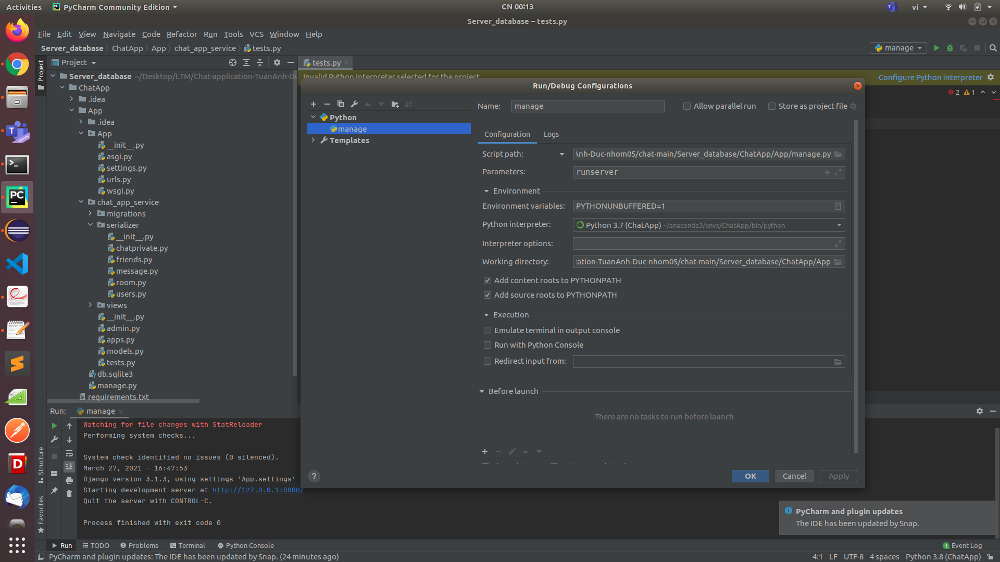

## Thực Hành Lập Trình Mạng
## Ứng dụng chat với lập trình socket - Ngôn ngữ lập trình C

# thành viên:
Nguyễn Văn Đức - 20176723 
Nguyễn Văn Đức - 20176692

# Tính năng của App:
- Các tính năng người dùng (Đăng ký, Đăng nhập…)
- Chat private
- Chat group
- Kết bạn (thêm, xóa, xem thông tin)
- Thay đổi mật khẩu
- Admin
# Ngôn ngữ lập trình:
- C (GUI, socket, libcurl, libjson-c)
- Python (Server database)
# Cong cu:
- GTK 3 , glade (Thiết kế Giao diện)
- libcurl, libjson-c (để truy vấn dữ liệu trên Database)
- socket - TCP 
- Visual Studio Code (Công cụ soạn thảo, các bạn có thể sử dụng các công cụ khác)
- Database: Django Framework, sqlite3, PyCharm, postman (Công cụ cần thiết để xây dựng Database server)

# Chạy app
- App được chạy trên Unix (linux)
- clone dự án về máy của bạn
- cd vào thư mục (Chat-application-TuanAnh-Duc-nhom05/chat-main) của dự án 
- cài các gói, thư viện cần thiết ở file build-gtk.txt (https://github.com/NguyenVanDuc-20176723/project_chat/blob/main/Chat-application-TuanAnh-Duc-nhom05/chat-main/build-gtk.txt)
- cấu hình server_database (thư mục Server_database của dự án): sử dụng PyCharm để cấu hình 
	
- sử dụng command (để tạo file chạy): make
- server: ./server port_number 
	vd: ./server 1212
- client: ./application 127.0.0.1 port_number 
	vd: ./application 127.0.0.1 1212

---------------------------end---------------------------
